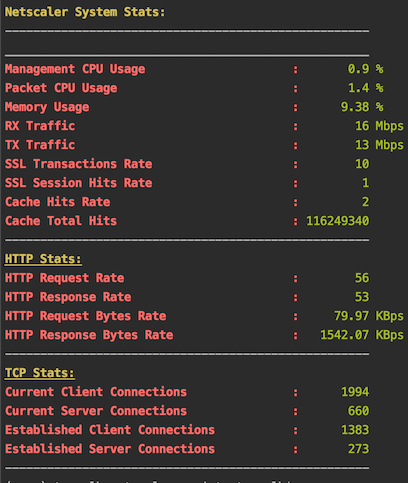
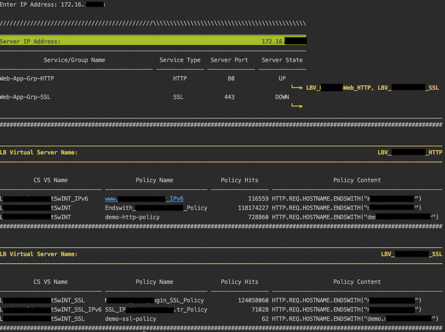
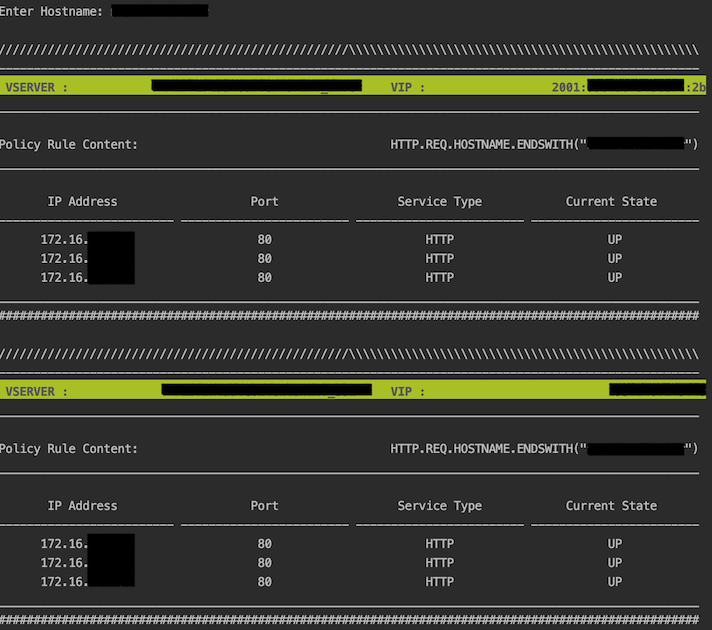

# About
> These scripts utilize Nitro api interface on Citrix Netscaler
to get some information and print on terminal screen in a formatted way.

1. **get_stats.py** : _prints some metrics and instant values about CPUs, memory,
RX/TX Traffic, HTTP, TCP Stats..._
2. **get_info_by_server_ip.py** : _Accepts IP address as input and prints
bound virtual servers, policies as output_
3. **get_servers_by_hostname.py** : _Accepts full domain address as input and prints bound
services (IP addresses), cookie values (for COOKIEINSERT enabled VSs), monitor status,
monitor details if DOWN_

---
## Screenshots

#### 1. get_stats.py
> Some NS Stats:



#### 2. get_info_by_server_ip.py
> Sample output for an entered IP address of an available service.



#### 3. get_servers_by_hostname.py
>  Sample output for an entered domain address that is context switched:



> Beware: Include a file named "credential.py" with content as below in the same directory
with these scripts; or uncomment relevant lines in scripts and enter credential.

```
USERNAME = "USERNAME"
PASSWORD = "PASSWORD"
NS_IP = "IP ADDRESS"
```